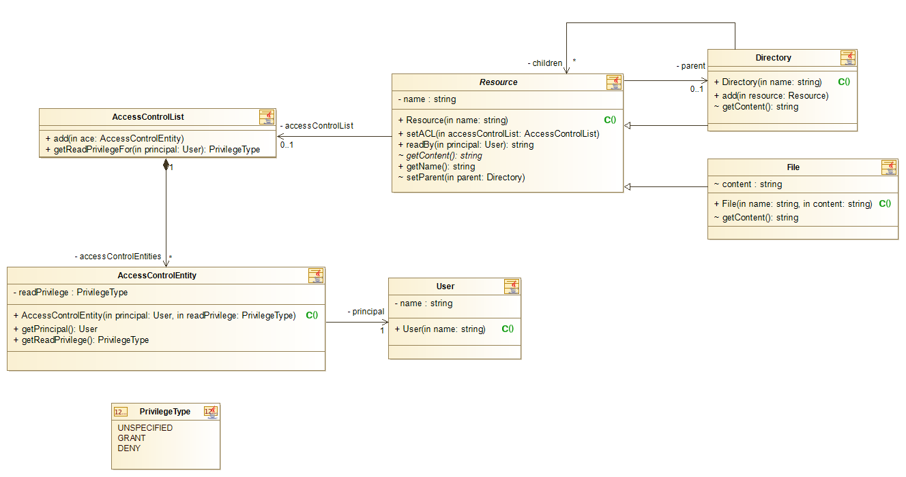

# Access Control
Access Control Lists (ACLs) are a very powerful means to grant or deny detailed access privileges on individual resources to users and groups. ACLs are used today in the most prevalent operating systems, as well as in any other system, where fine grained control of access is required. An example of a commercial product using ACLs can be found under the following link: [SAP NetWeaver Development Infrastructure](https://help.sap.com/doc/saphelp_gbt10/1.0/de-DE/21/53882f3fee0243b6c774e26ebed880/content.htm?no_cache=true).

Two main features of ACLs are:
- inheritance of granted or denied privileges within a hierarchy of resources and groups
- built-in rules that govern the precedence of granted or denied privileges to resolve conflicting settings

In this task you will implement a few classes for a simplified ACL system.

## Class Diagramm, Requirements
The following class diagram shows the required classes, their members and relationships. This diagram is to be considered mandatory.

### Class Descriptions
#### `Resource`

Abstract base class for directories and files. A directory may contain other directories and files, thus forming a tree structure.
A `Resource` object may have one or zero associated `AccessControlList` objects.

The `readBy` method is the key method of the system. It allows a user to read the contents of a resource, provided the process of privilege resolution results in granted read privilege. To decide whether access is granted the method consults the associated `AccessControlList` object. If there is no such object associated, the method diverts to the parent directory an tries to lookup an associated `AccessControlList` object there. This process is continued until the root directory is  reached.
On its way up to the root directory, the `readBy` method collects any read privilege setting for the given user. This may result in conflicts when contradictory settings are found. The rules section below specifies how such situations have to be resolved.

Finally, based on whether read access is granted or denied, the method returns the contents of the resource or the string `Access denied`. Also in case, where no settings for this particular user are found, access is denied.
The contents itself can be accessed through the abstract method `getContent`. For a directory its implementation returns a list of contained sub-directories and files. For files the implementation returns the file's contents as string.

#### `AccessControlList`
This class serves as container of `AccessControlEntity` objects. The method `getReadPrivilegeFor` searches the list of associated `AccessControlEntity` objects for the one object with the highest precedence for the given user (see rules section).

Note: For simplification the type (`final` or `ingnore inheritance`) are omitted here.

#### `AccessControlEntity`
This class associates a `User` object with granted or denied read privilege and represents an individual privilege setting. If type `UNSPECIFIED` is set, this has the same effect, as if there would be no `AccessControlEntity` object. On the other hand, there may also be more than one `AccessControlEntity` objects for a particular user, even with contradictory settings (e.g. grant and deny at the same time).

#### `User`
Normally users and groups are subsumed under the concept of principals and a similar inheritance mechanism is applied to group trees as with resource trees. However, to simplify things we omit this part and have only a class `User`.

## Rules
Note: The following text is based on the description in [SAP NetWeaver Development Infrastructure](https://help.sap.com/doc/saphelp_gbt10/1.0/de-DE/21/53882f3fee0243b6c774e26ebed880/content.htm?no_cache=true). However, rule number 4 of the original text is omitted as there are no groups in this task.

It is not necessary to define ACLs for all resources. On the other hand, it is possible to define mutually exclusive ACEs for the same resource. To solve these conflicts, the permissions (`GRANT`, `DENY`) are interpreted according to a set of specific rules that are applied independently for all privileges.

The resource path is used to determine the authorizations. The permissions  do not have to be defined for all resources: A resource of a lower hierarchy level inherits all permissions that have been assigned to a higher-level folder if permissions have not been assigned directly to it.

From the five rules described in the reference only the two following shall be implemented:
1. child before parent 
Permissions set directly on a resource do overrule inherited permissions from parent folders. Therefore an inherited `DENY` is overruled by a direct `GRANT` (called an explicit `GRANT`).
1. `DENY` before `GRANT`
If there are conflicting settings for a particular user on one and the same resource, then the precedence is as follows: 
`DENY` before `GRANT` before `UNSPECIFIED`

The order of the above rules governs their precedence. Thus rule 1 overrules rule 2.

## Implementation Steps
For the implementation it is recommended to proceed according to the following steps:

1. Implement skeletons for all classes of the diagram above. I.e classes with instance variables and method headers, but empty method bodies (except getters, setters and initialization in constructors)
1. Implement the `getContent()` methods and test them with unit tests
1. Complete the classes `AccessControlList` and `AccessControlEntity` according to the description in the requirements section. This includes rule 2 which is implemented by the method `getReadPrivilegeFor` of class `AccessControlList`. Test everything with unit tests.
1. First implementation of  method `readBy` of the `Resource` class. In this step the method shall only look for ACLs on the actual resource. Test everything with unit tests.
1. Refactoring of method `readBy`: Now inheritance of ACLs from parent resources and rule 1 shall be implemented and tested.
